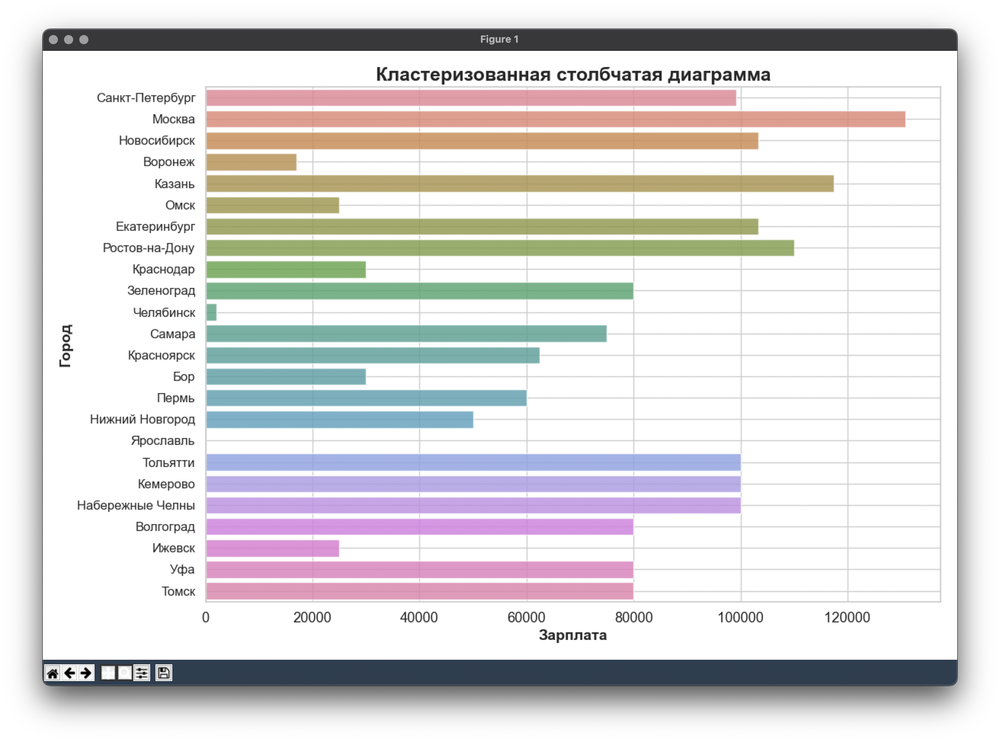

# Учебный проект
## Сбор и анализ данных с hh.ru

Интерфейс на теме "Superhero":

**Авторы:**
- Глинник Егор
- Елисеев Иван
- Чибиров Руслан

---

## Описание

Данный проект разработан для удобного сбора и визуализации данных о вакансиях с сайта hh.ru. GUI позволяет пользователю вводить запрос (текст запроса и город) для анализа, а затем отображает различные графики и текстовые отчеты на основе полученных данных.

---

## Основные функции

1. **Сбор данных:**
   - Пользователь вводит запрос и город для поиска вакансий на сайте hh.ru.
   - После нажатия кнопки "Поиск" происходит сбор данных и обновление интерфейса.

2. **Отображение графиков:**
   - После завершения сбора данных доступны кнопки для построения различных типов графиков:
     - Зарплата по вакансиям
     - Опыт работы по вакансиям
     - Тип занятости по вакансиям
     - Требования по вакансиям
     - Уровень вакансий
     - Специальность вакансий

Например: 

3. **Пользовательские графики:**
   - В разделе "Пользовательские графики" пользователь может выбрать параметры для создания персонализированных графиков.

Например: 

4. **Текстовые отчеты:**
   - Предоставляются кнопки для генерации текстовых отчетов:
     - Простой текстовый отчет
     - Сводная таблица
     - Статистический отчет

5. **Настройки интерфейса:**
   - Пользователь может выбрать тему оформления (Darkly, Yeti, Solar, Superhero) и шрифт (Arial или Times New Roman).

---

## Использование

1. **Установка зависимостей:**
   - Убедитесь, что у вас установлены все необходимые библиотеки, указанные в файле `requirements.txt`:
   `pip install notes/requirements.txt`
   - Обновите версию `pip`:  
   `pip install --upgrade pip`

2. **Запуск приложения:**
   - Запустите файл `main.py`, чтобы открыть GUI приложение.
   - Выберите параметры поиска и используйте кнопки для визуализации данных и генерации отчетов.

